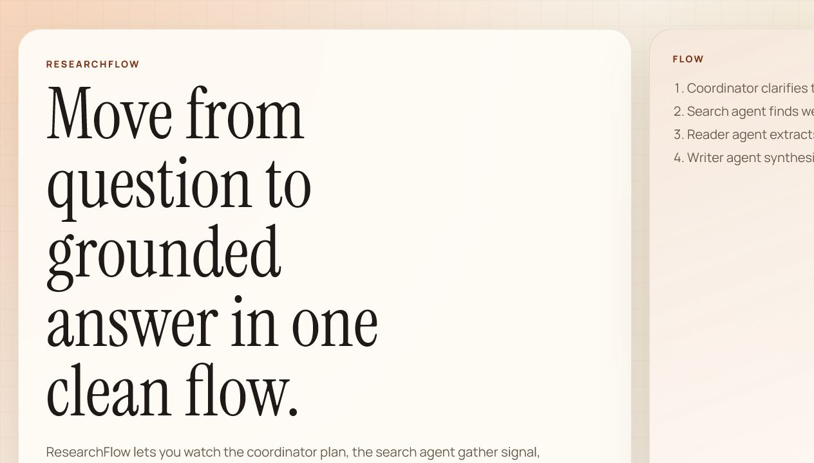

# ResearchFlow

ResearchFlow is a small but real LangGraph research system: one agent clarifies the question, one searches, one reads sources, and one writes the final answer. I also added a frontend so the whole flow is easier to understand, demo, and show off.



## What You Built

ResearchFlow is not just "LLM in, answer out."

It shows the full research loop:

- A **Coordinator Agent** turns a raw prompt into a cleaner research task.
- A **Search Agent** finds relevant web results and optional Wikipedia context.
- A **Reader Agent** fetches the best pages and extracts the useful signal.
- A **Writer Agent** synthesizes everything into one final answer with sources.
- A **FastAPI backend** exposes the workflow through HTTP and WebSockets.
- A **minimal frontend** now lets you watch the LangGraph run live.
- A **SQLite history layer** keeps past research runs around for review.

## Why It Feels Better Than Most LangGraph Demos

A lot of LangGraph examples stop at a notebook, a CLI printout, or a single graph image. This project goes further in a way that is actually useful when you want to demo or build on top of it:

- It has a **real user interface**, not just backend logic.
- It shows **live progress** while each agent works.
- It keeps **research history**, so runs do not disappear after one request.
- It combines **multiple source-gathering strategies** instead of relying on one prompt.
- It is structured in a way that is easy to extend with more agents, better routing, or richer memory later.

So the strength here is not that it claims to be the biggest LangGraph system. The strength is that ResearchFlow is already a clean end-to-end product surface: orchestrated agents, API, persistence, and a frontend that makes the orchestration visible.

## Frontend Highlights

The new frontend is designed to be minimal, warm, and demo-friendly:

- A focused landing area that explains the multi-agent story quickly
- A research composer with sample prompts
- Live agent-status cards driven by WebSocket updates
- A final answer panel for the synthesized result
- A source list for traceability
- A recent-history section so previous runs stay visible
- Product naming and demo framing built around `ResearchFlow`

## Architecture

```text
User
  -> Frontend
  -> FastAPI API
  -> LangGraph Workflow
     -> Coordinator
     -> Search
     -> Reader
     -> Writer
  -> SQLite history
```

## Project Structure

```text
src/
  agents/      Agent implementations
  api/         FastAPI server, WebSocket manager, and static frontend
  graph/       LangGraph workflow
  memory/      SQLite storage
  tools/       Web search, fetch, and Wikipedia helpers
  utils/       Config and cost tracking
tests/         Basic test coverage
docs/          README assets such as the frontend screenshot
```

## Run It Locally

### 1. Install dependencies

```bash
pip install -r requirements.txt
```

### 2. Create your environment file

```bash
cp .env.example .env
```

Add your keys:

```env
OPENAI_API_KEY=your_openai_api_key
TAVILY_API_KEY=your_tavily_api_key
```

### 3. Start the app

```bash
python -m uvicorn src.api.main:app --reload
```

Open:

- Frontend: `http://localhost:8000/`
- API root: `http://localhost:8000/api`
- Health check: `http://localhost:8000/health`

## API Endpoints

### Start research

```http
POST /research
Content-Type: application/json
```

```json
{
  "question": "What are the latest developments in quantum computing?",
  "use_wikipedia": true
}
```

### Fetch one result

```http
GET /research/{research_id}
```

### Fetch history

```http
GET /research/history?limit=20&offset=0
```

### Watch live progress

```text
ws://localhost:8000/ws/{research_id}
```

## What Changed In This Version

- Added a polished static frontend served directly from FastAPI
- Connected the UI to the research API and research history
- Wired WebSocket progress into the actual LangGraph execution flow
- Added a real frontend screenshot to the README
- Rewrote the README to explain the project in a more human, showcase-friendly way

## Tests

Run the tests with:

```bash
pytest tests/
```

## Where To Take It Next

If you want to push this further, the next strong upgrades would be:

- dynamic routing instead of a fixed linear flow
- deeper source validation and ranking
- richer citations in the final answer
- user accounts or saved workspaces
- agent traces and observability for each run

## License

MIT
