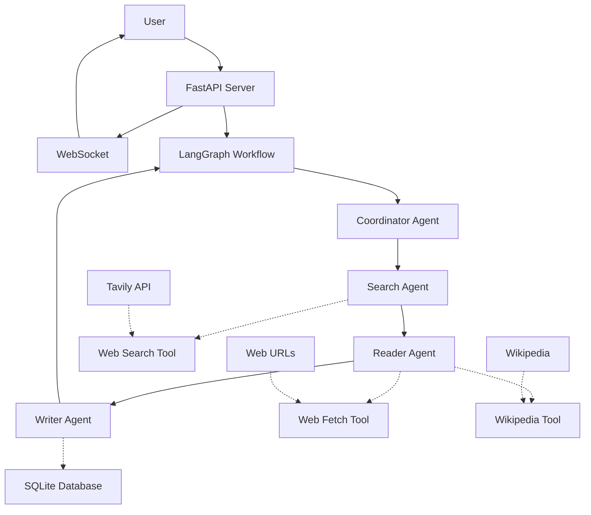

# Multi-Agent Research Assistant - Implementation Plan

## Project Overview
Build an AI-powered research assistant where multiple specialized agents work together using LangGraph to answer complex questions.

## Architecture Diagram



## Implementation Steps

### Step 1: Project Setup & Configuration
- Create directory structure: `src/agents/`, `src/tools/`, `src/graph/`, `src/api/`, `src/memory/`, `src/utils/`, `tests/`
- Create `requirements.txt` with all dependencies
- Create `.env.example` with required API keys
- Create `src/utils/config.py` for configuration management

### Step 2: Core Tools Implementation
- `src/tools/web_search.py` - Tavily API integration with 30s timeout
- `src/tools/web_fetch.py` - URL content fetching with BeautifulSoup
- `src/tools/wikipedia.py` - Wikipedia API integration

### Step 3: Agent Implementation
- `src/agents/search_agent.py` - Uses web search tool
- `src/agents/reader_agent.py` - Fetches and summarizes URLs
- `src/agents/writer_agent.py` - Combines information into coherent answer
- `src/agents/coordinator.py` - Routes tasks and manages workflow

### Step 4: LangGraph Workflow
- `src/graph/workflow.py` - Define state, nodes, and edges
- Connect all agents in sequence: Coordinator → Search → Reader → Writer

### Step 5: Storage & Memory
- `src/memory/storage.py` - SQLite operations for research history

### Step 6: API & WebSocket
- `src/api/main.py` - FastAPI server with endpoints
- `src/api/websocket.py` - Real-time progress updates
- Endpoints: POST /research, GET /research/{id}, GET /research/history, WebSocket /ws

### Step 7: Cost Tracking
- `src/utils/cost_tracker.py` - Token counting and cost calculation

### Step 8: Testing & Documentation
- `tests/test_agents.py` - Agent unit tests
- `tests/test_tools.py` - Tool unit tests
- `README.md` - Project documentation

## API Endpoints

| Endpoint | Method | Description |
|----------|--------|-------------|
| `/research` | POST | Start new research query |
| `/research/{id}` | GET | Get results of completed query |
| `/research/history` | GET | List past research queries |
| `/ws` | WebSocket | Real-time progress updates |

## File Structure

```
research-assistant/
├── src/
│   ├── agents/
│   │   ├── coordinator.py
│   │   ├── search_agent.py
│   │   ├── reader_agent.py
│   │   └── writer_agent.py
│   ├── tools/
│   │   ├── web_search.py
│   │   ├── web_fetch.py
│   │   └── wikipedia.py
│   ├── graph/
│   │   └── workflow.py
│   ├── api/
│   │   ├── main.py
│   │   └── websocket.py
│   ├── memory/
│   │   └── storage.py
│   └── utils/
│       ├── cost_tracker.py
│       └── config.py
├── tests/
│   ├── test_agents.py
│   └── test_tools.py
├── requirements.txt
├── .env.example
└── README.md
```

## Key Implementation Details

### State Management
The LangGraph state will contain:
- `question`: Original user question
- `search_query`: Optimized search query
- `search_results`: Results from search tool
- `read_content`: Content fetched from URLs
- `final_answer`: Final response from writer agent
- `progress`: Current progress percentage
- `current_agent`: Name of currently running agent
- `cost`: Total cost of the query

### WebSocket Messages
```json
{
  "agent": "SearchAgent",
  "status": "running",
  "message": "Found 5 relevant articles",
  "progress": 0.4,
  "timestamp": "2025-03-09T10:23:15Z"
}
```

### SQLite Schema
```sql
CREATE TABLE research_history (
    id TEXT PRIMARY KEY,
    query TEXT NOT NULL,
    final_answer TEXT,
    cost REAL,
    timestamp DATETIME DEFAULT CURRENT_TIMESTAMP
);
```
